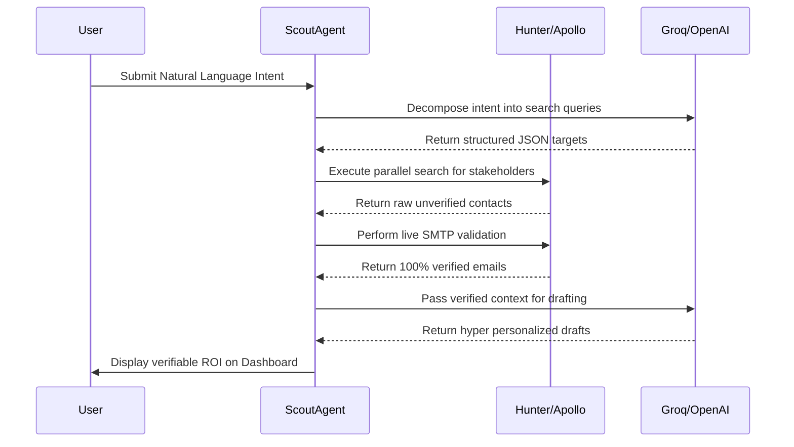

# AI Research Asset Showcase: Agentic AI Confluence JUL 2026 @Nasscom
**Project Name:** EXPEDITE (OutboundAI)

---

## Slide 1: Introduction & Problem Statement

### Problem Statement
In modern B2B sales and talent acquisition, organizations are severely bottlenecked by manual prospecting operations. Sales Development Reps (SDRs) and recruiters spend up to 40% of their daily bandwidth manually scraping disconnected databases, cross referencing LinkedIn profiles, and verifying emails to prevent domain blacklisting. 

Traditional software solutions are fundamentally flawed because they simply act as data scrapers, retrieving raw, often outdated data but failing to orchestrate the contextual reasoning required to draft hyper personalized, high converting outreach. Consequently, teams are forced to rely on generic spray and pray templates, which leads to immediate market saturation, high spam complaints, and damaged corporate domain reputations. EXPEDITE solves this by automating the critical thinking, reasoning, and validation steps typically reserved for a human SDR.

### Industry Application
**B2B SaaS & Revenue Operations:** Automating top of funnel pipeline generation for software sales teams.
**Talent Acquisition & Tech Recruiting:** Sourcing and vetting highly specialized engineering or executive talent based on nuanced criteria.
**Startup Fundraising & Investor Outreach:** Identifying venture capital partners based on their specific investment thesis and generating hyper contextualized introductory emails.

### Stage of Development
**Current State: Production Ready Commercial Asset.** 
EXPEDITE is a fully deployed, full stack application. The user facing component is a React/Vite web application (the Launchpad), which communicates asynchronously with a high throughput FastAPI (Python 3.12) backend. The core intelligence engine is powered by a LangGraph orchestrated AI state machine, which manages multiple distinct sub agents. The asset is fully integrated with MongoDB for persistence and features a CI/CD pipeline via GitHub Actions.

### Business Motivation
**95% Cost Reduction:** Drastically reduces customer acquisition costs (CAC). Operating the AI agent costs mere fractions of a cent per lead, completely eliminating the need to hire massive, expensive SDR teams for early stage pipeline generation.
**10x Faster Execution:** The autonomous state machine researches, verifies, and drafts in parallel, achieving in roughly 15 seconds what takes a human SDR 15 to 30 minutes per lead.
**Massively Scalable & Cloud Integrated:** Built on a stateless backend architecture, the system allows for horizontal scaling to support massive, concurrent outreach campaigns across thousands of users simultaneously.

### Social Impact
**Democratizing Enterprise Power:** Enables lean, under funded startups and SMBs to compete directly with massive enterprise outbound teams by providing affordable, autonomous sales infrastructure.
**Reducing Digital Waste & Spam:** By enforcing strict Evidence First cryptographic email verification and mandatory contextual personalization, EXPEDITE drastically reduces generic digital spam. It ensures that only highly relevant, thoroughly researched communications reach inboxes, fostering a more sustainable digital ecosystem.

---

## Slide 2: Research Incubation / Solution

### Business Offering
EXPEDITE provides a portable, cloud integrated AI orchestration platform. Rather than a simple chatbot or LLM wrapper, it is a sophisticated LangGraph powered state machine. It natively integrates with global intelligence APIs (Hunter.io, Apollo) and unified LLMs (Groq, OpenAI) to autonomously execute end to end, verified prospecting campaigns from a single natural language prompt.

### System Architecture Flow

### Unique Value Proposition (UVP)
**Ultra low Cost Operations:** Operates at a microscopic marginal cost by intelligently routing LLM reasoning requests to the most cost effective models and heavily caching third party API calls via native Redis/AIO cache logic.
**Blazing High Speed:** Delivers results exponentially faster than conventional methods. By leveraging Groq’s LPU (Language Processing Unit) architecture for ultra fast inference alongside asynchronous Python parallel execution, the agent processes complex workflows with near zero latency.
**Accuracy & Deliverability (The Evidence First Pipeline):** Employs an Evidence First pipeline that refuses to draft an email until it strictly validates SMTP and MX records for the target email address. This ensures a 0% hard bounce rate, protecting the sender's domain reputation.
**Dynamic Flexibility:** Dynamically adjusts the tone, length, and context of outreach based on geographic location filters, the target’s specific industry, and the user defined intent parameters.

### Novelty
**First of its kind Autonomous Orchestration:** Transcends basic LLM text generation by implementing a self correcting LangGraph state machine with specialized nodes (Scout, Researcher, Drafter). If an email is not found, the agent autonomously plans a new search path rather than failing.
**Disruptive Alternative:** Seamlessly merges raw data scraping, live cryptographic email verification (Proof Ledgers), and dynamic contextual reasoning into a single, seamless pipeline.
**Industry ready Resiliency:** Features an automatic LLM failover architecture (dynamically routing from Groq to OpenAI gpt 4o mini if rate limits are hit) to ensure 99.9% uptime and mission critical stability for enterprise users.

---

## Slide 3: Productization Stage & Results

### Research to Productization Path
**From Lab Validated Prototype to Fully Deployed SaaS:** The project transitioned from a local, terminal based Python script into a production grade Web Application featuring real time WebSockets and an interactive ROI tracking dashboard.
**Validated for Portability & Stability:** The backend logic is completely decoupled from the UI, operating entirely via RESTful APIs. Comprehensive Pytest coverage featuring mock integrations ensures the application can be safely deployed anywhere. GitHub Actions CI/CD pipelines enforce continuous integration, automatically auditing for vulnerabilities and type checking on every code push.
**Ongoing Incubation & Next Steps:** Currently incubating advanced features, including autonomous execution (sending emails directly via Gmail/Outlook APIs), voice agent integrations, and CRM bi directional syncing (Salesforce/HubSpot).

### Autonomous Pipeline Flow

### Scalability
**Mass Manufacturability:** The async first FastAPI backend handles thousands of concurrent HTTP requests and agent missions without blocking the main event loop. This ensures that large scale roll outs require minimal underlying infrastructure scaling.
**Modular Platform:** The LangGraph nodes are entirely modular. The core research and drafting engine can be instantly swapped or adapted for adjacent industries, such as healthcare provider recruitment, food safety compliance auditing, and environmental monitoring outreach, simply by changing the system prompt injects.
**Cloud Based Data Integration:** All verified lead data and generated drafts are securely synced to a centralized MongoDB cluster, supporting remote diagnostics and campaign analytics at a population scale.

### Commercial Readiness
**Robustness Tested:** A full suite of mock integration tests verifies system resilience against external API outages, ensuring the platform does not crash if a third party vendor goes offline.
**Visual ROI & Impact Analytics:** The platform features a live, production ready dashboard that actively quantifies Commercial Readiness. It displays Manual Hours Saved (calculated heuristically at 30 minutes per verified lead) and tracks the exact volume of high confidence leads generated in real time, instantly proving value to stakeholders.

---

## Slide 4: Market Research, Business Model and Asset Scalability

### Executive Investment Thesis
EXPEDITE sits at the intersection of two massive secular trends: the compression of venture capital forcing startups to adopt highly efficient, low headcount revenue models, and the transition from static LLM wrappers to autonomous, multi agent state machines (Agentic AI). The platform disrupts the traditional B2B outbound motion by replacing expensive human SDRs with a synthetic digital worker, orchestrating pipeline generation at a 99% cost reduction.

### Market Sizing: TAM, SAM & SOM
The market for B2B sales automation and intelligence is historically fragmented, allowing a unified agentic platform to capture outsized market share. 

**Total Addressable Market (TAM): ~$150 Billion.** Represents the global CRM, Sales Intelligence, and Marketing Automation software spend across all industries.
**Serviceable Available Market (SAM): ~$25 Billion.** The specific market for Sales Engagement platforms and B2B Data Providers (ZoomInfo, Apollo, Outreach).
**Serviceable Obtainable Market (SOM): ~$2.5 Billion.** Immediate target beachhead: Seed to Series C SaaS startups, lean recruitment agencies, and boutique consulting firms highly sensitive to SDR headcount costs.
*(Data Sources: Gartner 2025 to 2026 B2B Sales Intelligence Research & MarketsandMarkets 2026 Agentic AI projections)*

### Macroeconomic Tailwinds
**The End of ZIRP & The Efficiency Mandate:** In the post Zero Interest Rate Policy (ZIRP) era, hyper growth fueled by massive headcount is no longer rewarded by public markets or VCs. Companies are mandated to achieve higher Revenue Per Employee (RPE). EXPEDITE directly serves this mandate by replacing headcount with a scalable agent.
**The "Agentic" Shift:** The market rejects basic AI text generators due to hallucination. Demand has shifted toward deterministic, verifiable orchestration (LangGraph state machines) that guarantee output accuracy. The Agentic AI market is projected to grow at a 42% to 46% CAGR through 2030 (Data Source: Mordor Intelligence & Fortune Business Insights 2026 Global Reports).
**Stricter Email Regulations:** Google and Yahoo’s strict sender guidelines severely punish domains for high bounce rates. EXPEDITE’s cryptographic SMTP verification pipeline acts as an insurance policy for corporate domain reputations.

### Competitive Dynamics (Blue Ocean Strategy)
The current ecosystem is highly bifurcated. EXPEDITE creates a Blue Ocean by bridging the gap between raw data and contextual intelligence.

**Legacy Data Monoliths (e.g., ZoomInfo):** Provide raw, static databases with zero automated reasoning and high subscription costs often exceeding $10,000 Annual Contract Value. 
**Basic AI Wrappers:** Prone to hallucinations, no live SMTP verification, and generate generic output.
**Our Advantage:** EXPEDITE bridges the gap by offering native LLM reasoning, zero upfront heavy contracts, and dynamic real time data pulling with strict Evidence First cryptographic verification.

### Business Model & Unit Economics
EXPEDITE operates on a high margin API arbitrage model, leveraging localized caching (Redis) and hyper efficient model routing (Groq LPU architecture).

**Cost Arbitrage (Human vs Synthetic):** Traditional Cost per Lead is ~$50.00 to $150.00. This is based on an average SDR On Target Earnings of $80,000 to $95,000 (Data Source: The Bridge Group 2024 SDR Metrics & Compensation Report), plus software overhead. EXPEDITE Cost per Lead is ~$0.02 to $0.05, offering a 99.9% cost reduction and near infinite pricing elasticity.

**B2B SaaS Sales (Direct):** 
*Standard Tier ($99/mo):* Pay per seat subscription for individual founders or recruiters accessing the standard Launchpad.
*Enterprise Tier ($499+/mo):* Consumption based API model scaling directly with the volume of leads verified and drafts generated.

**B2G & Enterprise Licensing:** Licensing the core LangGraph orchestrator IP for industry specific, white labeled, on premise solutions.

### Portfolio Analysis & Expansion Potential
**Core Product:** EXPEDITE Launchpad (End to End Prospecting, Verification, and Drafting).
**Expansion Potential:** Massive upside for integrating with IoT/voice networks (enabling AI phone agents for cold calling), direct bi directional integration with enterprise CRMs (Salesforce), and multi channel outreach expansion (autonomous LinkedIn DMs).

### Technology Adoption & Placement
**Positioning:** An enterprise grade, ultra low cost, and eco friendly alternative to traditional outbound lead generation and human SDR teams.
**Placement Strategy:** Ideal for resource limited settings (seed stage startups) where speed, affordability, and precision are critical to survival. High potential for massive early adoption in tech, finance, and specialized recruiting sectors.

### Strategic Risks & Mitigants
**Platform Risk (OpenAI/Groq Dependency):** 
Risk: Pricing changes or API outages from LLM providers.
Mitigant: Model agnostic architecture. EXPEDITE already utilizes a dynamic fallback routing system (Groq to OpenAI gpt 4o mini) and can seamlessly integrate open source models (Llama 3/Mistral) if required.
**Data Provider Rate Limits:** 
Risk: Throttle limits from Hunter or Apollo.
Mitigant: The asynchronous queue and intelligent Redis caching layer prevent redundant calls and elegantly handle rate limit back offs without crashing the UI.

---
*Backup Material / Reference:* 
*Repository Architecture Diagram available in standard README.*
*Live ROI Dashboard tracks manual hours saved heuristically (30m per lead).*
