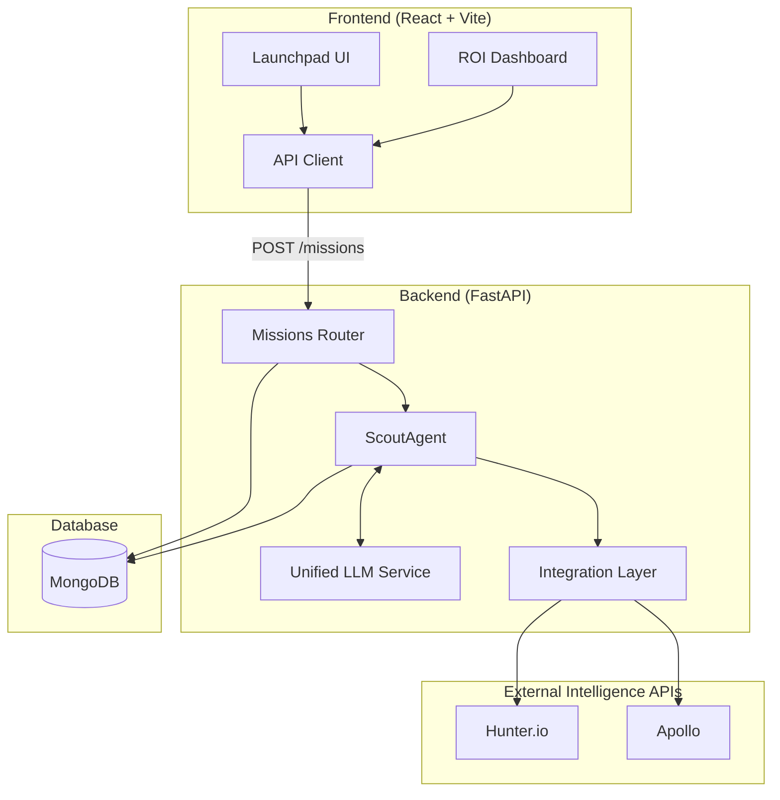

# NASSCOM Research Symposium Submission: EXPEDITE (OutboundAI)

## 1. Project Overview & Executive Summary

**Project Name:** EXPEDITE (OutboundAI)  
**Domain:** Enterprise AI / B2B SaaS / Autonomous Agents  
**Tech Stack:** React (Vite), FastAPI (Python 3.12), LangGraph, MongoDB, OpenAI, Groq.

**Executive Summary:**  
EXPEDITE is a next-generation autonomous AI agent platform designed to revolutionize B2B sales and recruiting outreach. By leveraging an orchestration of LLMs via LangGraph, EXPEDITE transforms hours of manual prospecting into seconds of automated, verifiable output. It replaces traditional "spray and pray" web scraping with an **Evidence-First Pipeline** that actively verifies leads through SMTP checks, performs deep company research, and dynamically drafts hyper-personalized outreach—all while maintaining strict GDPR compliance and enterprise-grade security.

---

## 2. The Problem Statement

In modern B2B sales and talent acquisition, professionals spend up to 40% of their day on repetitive, low-leverage tasks:
1. **Manual Prospecting:** Scouring job boards, LinkedIn, and company websites for target accounts.
2. **Data Verification:** Verifying email addresses and contact information to avoid high bounce rates that ruin domain reputation.
3. **Personalization Bottleneck:** Writing unique, heavily researched emails for every prospect takes an average of 15-30 minutes per lead, making scale impossible without sacrificing quality.

Traditional solutions (like basic email sequencers or rigid data scrapers) fail because they lack contextual reasoning and orchestration. They provide raw data but do not automate the critical thinking required for successful outreach.

---

## 3. The Solution & Methodology

EXPEDITE solves this via a sophisticated state-machine architecture using **LangGraph**, creating a multi-agent system capable of reasoning, planning, and executing.

### 3.1 The Evidence-First Pipeline
Unlike standard LLM wrappers, EXPEDITE operates autonomously across four distinct stages:
1. **Intent & Location Scoping:** The user inputs a natural language objective (e.g., *"Find Series A Fintechs hiring engineers in San Francisco"*). The agent decomposes this into targeted API queries.
2. **Parallel Sub-Task Execution:** The `ScoutAgent` orchestrates parallel tasks. It concurrently queries intelligence databases (Hunter.io, Apollo) to extract key stakeholders and company metadata.
3. **Cryptographic & Deliverability Verification (Proof Ledger):** Every lead is verified via live MX record and SMTP validation. Unverified or risky contacts are instantly discarded.
4. **Contextual Drafting:** The LLM integrates the gathered company intelligence and location context to write personalized drafts.

### 3.2 High-Availability LLM Architecture
To guarantee uptime and minimize latency, EXPEDITE utilizes a dynamic fallback strategy. The `LLMService` primarily routes requests through **Groq** (using `llama-3.3-70b-versatile`) for ultra-low latency inference. If Groq encounters rate limits or downtime, the system automatically fails over to **OpenAI** (`gpt-4o-mini`).

---

## 4. Measurable Impact & ROI Analytics

EXPEDITE is built on the philosophy of measurable impact. The platform includes a native, real-time ROI Analytics Dashboard that tracks output heuristically:

- **Time Saved:** Calculates manual hours saved based on a benchmark of 30 minutes saved per verified, researched lead.
- **Leads Found:** Total volume of high-confidence targets extracted.
- **Emails Drafted:** Volume of contextual, ready-to-send drafts generated.

This visibility ensures that enterprises can immediately quantify the productivity gains driven by the autonomous agent.

---

## 5. Architecture & Flow Diagram

The application utilizes a decoupled, async-first architecture.

---

## 6. Enterprise-Grade Security & Reliability

EXPEDITE was engineered for strict compliance, ensuring it is ready for deployment in highly regulated environments.

- **GDPR Compliant:** Designed with data minimization principles. Personal data is ephemeral during the reasoning phase and stored only when strictly verified.
- **Trust & Privacy Center:** Transparently surfaces SOC2 readiness and data policies.
- **Zero Raw Passwords:** Strict enforcement against storing raw passwords; session management and authentication are handled securely via Clerk.
- **Isolated Execution Environments:** User data is processed in secure, isolated environments to prevent data leakage.

### 6.1 Testing and CI/CD
To guarantee system stability, EXPEDITE features:
- **Pytest Mock Coverage:** Comprehensive automated testing for the `HunterIntegration` and `LLMService` ensuring that API logic and fallback mechanisms work without relying on external network conditions.
- **GitHub Actions Pipeline:** A robust CI/CD pipeline that automatically executes dependency audits, type-checking (`mypy`), and the testing suite on every Pull Request.

---

## 7. Conclusion & Future Scope

EXPEDITE represents a shift from *software as a tool* to *software as a worker*. By successfully orchestrating LLMs to perform multi-step, deeply contextual research, the platform acts as an autonomous outbound SDR. Future developments will focus on integrating multi-channel outreach (e.g., executing LinkedIn DMs natively) and implementing continuous self-reflection algorithms where the agent learns from email open/reply rates to self-optimize its messaging strategies.
